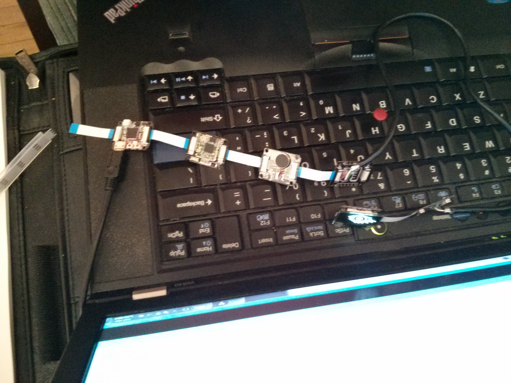
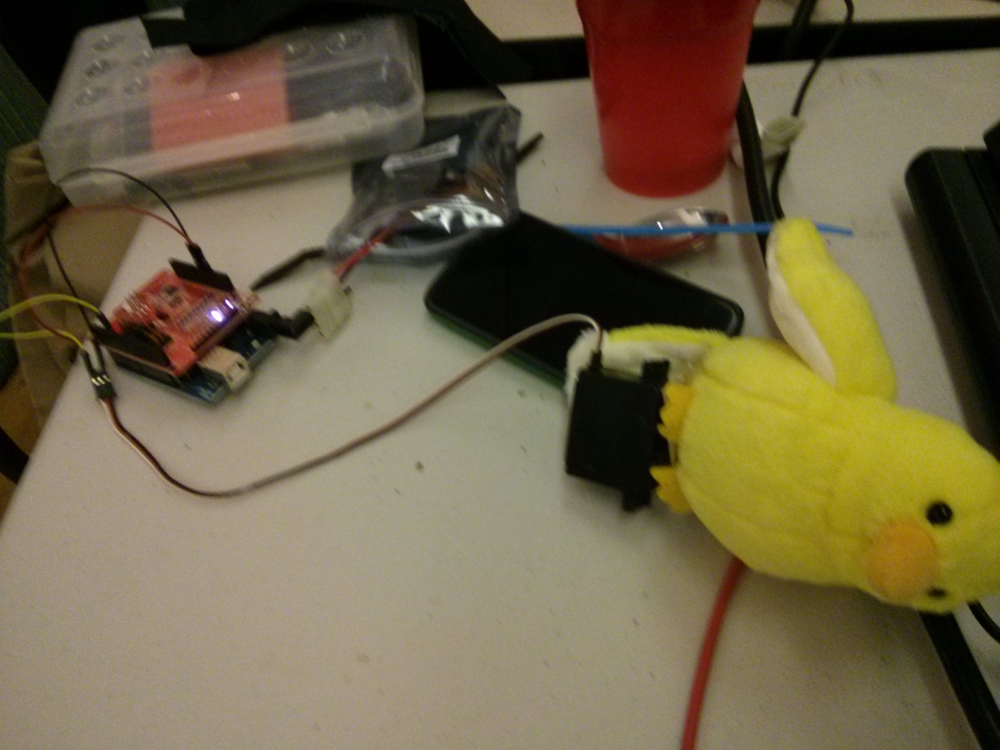
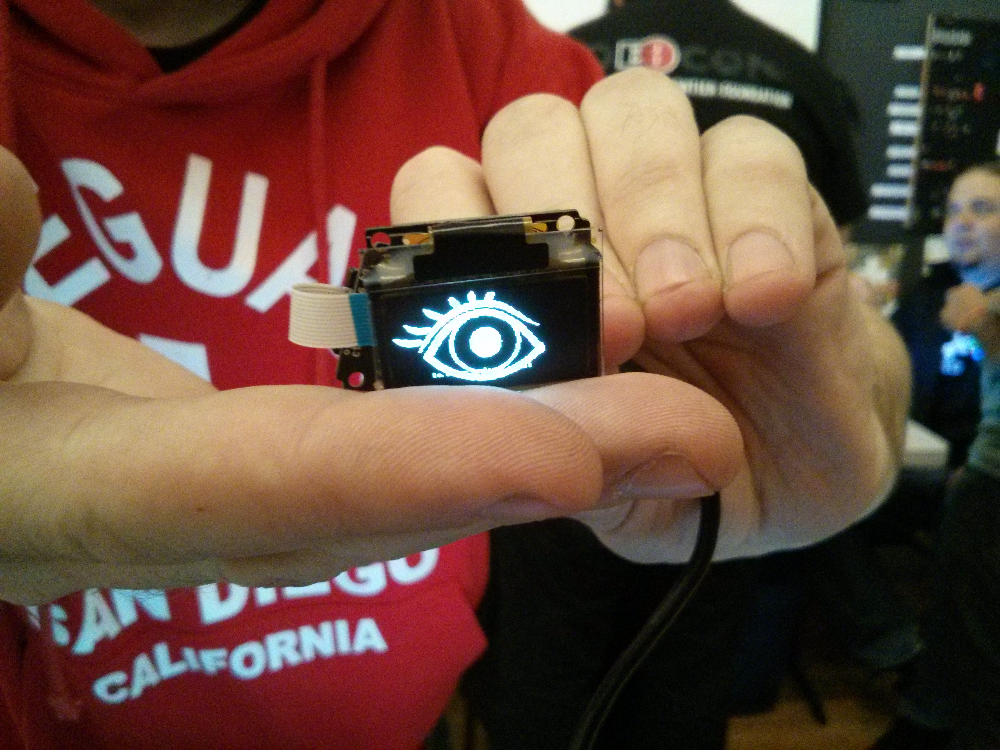
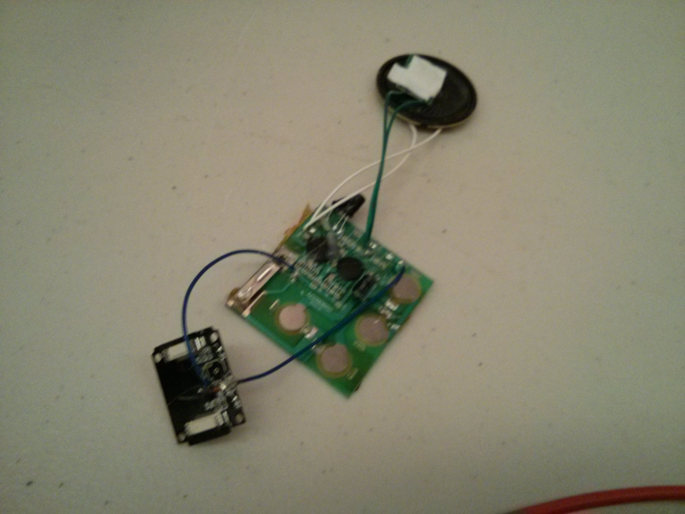

## Team 7 - Pirate Hackers

### What we built

A bluetooth based costume for the pirate hacker in all of us.

### Components

#### Flippin' the Bird

- Arduino Uno
- Redbear BLE shield
- Android BLE app
- Parallax motor
- Hot glue
- Bird
- Nexus 4

#### "Eye of the Pirate" eyepatch

- Xadow
- Xadow BLE board
- Two breakout boards used as a cable extender
- Xadow OLED screen
- Leather cutouts
- Hacked recordable greeting card
  - Used power driver
  - Modified Xadow buzzer for trigger
  - 

### What is this?

All will be revealed in due time. Contain your excitement.